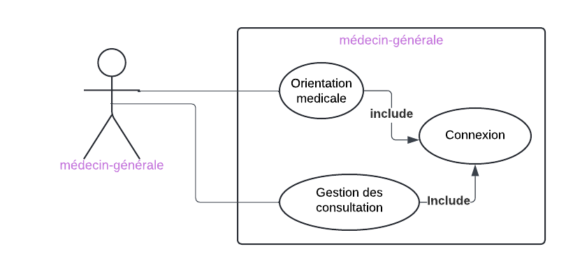

# Idéation 
{:class="sectionHeader"}

<!-- new slide -->
## Idéation de médecin-générale
{:width="700px" }*Figure: Idéation de médecin-générale*
<!-- note -->

- **Application de gestion des dossiers médicaux et sociaux :** Concevoir une application qui permet à l'infirmière de saisir et de gérer facilement les informations des patients, y compris les dossiers médico-sociaux, les détails de la mise en charge et d'autres données pertinentes.
- **Interface utilisateur conviviale :** Assurer que l'application dispose d'une interface utilisateur conviviale et intuitive, facilitant la saisie des données et la navigation entre les différentes sections des dossiers.
- **Modèles de saisie de données :** Intégrer des modèles de saisie de données préétablis pour différents types de dossiers, ce qui simplifie le processus de documentation et garantit la cohérence des informations enregistrées.
  
<!-- new slide -->
## Diagramme de cas d’utilisation

{:width="700px" }*Figure: Diagramme de cas d’utilisation de médecin-générale*

